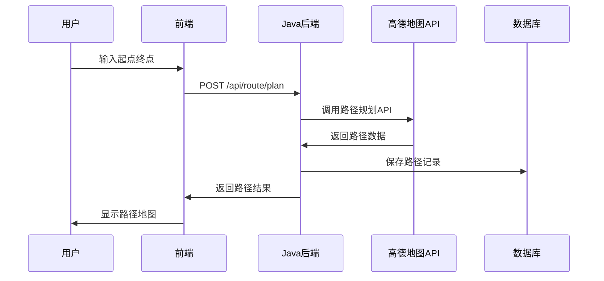
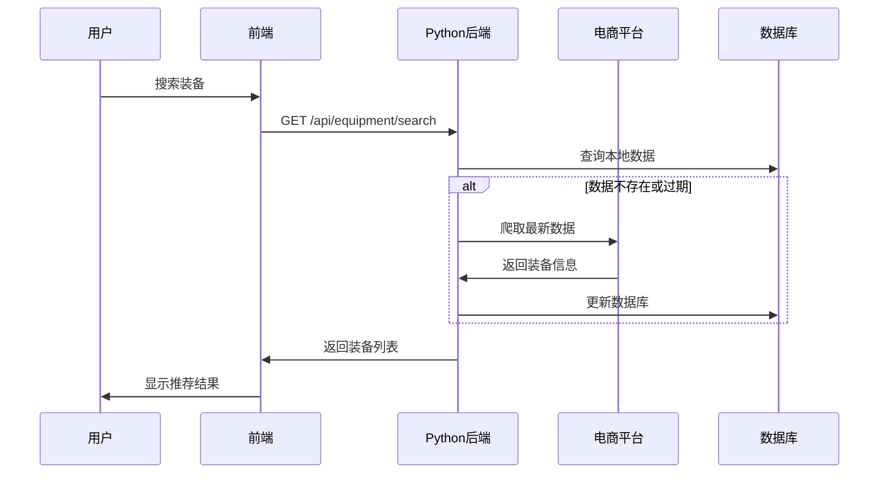

# 灵境行者 - 系统架构设计

## 📋 目录

- [架构概览](#-架构概览)
- [技术选型](#-技术选型)
- [系统分层](#-系统分层)
- [数据流设计](#-数据流设计)
- [安全架构](#-安全架构)
- [性能优化](#-性能优化)
- [扩展性设计](#-扩展性设计)

## 🏗️ 架构概览

### 整体架构图

```
┌─────────────────────────────────────────────────────────────┐
│                        用户层                                │
├─────────────────────────────────────────────────────────────┤
│                     前端应用层                               │
│  ┌─────────────────────────────────────────────────────────┐ │
│  │              Vue3 + Vite                               │ │
│  │  ┌─────────────┐ ┌─────────────┐ ┌─────────────────┐   │ │
│  │  │   路由管理   │ │   状态管理   │ │    组件库       │   │ │
│  │  │ Vue Router  │ │   Pinia     │ │ Element Plus   │   │ │
│  │  └─────────────┘ └─────────────┘ └─────────────────┘   │ │
│  └─────────────────────────────────────────────────────────┘ │
├─────────────────────────────────────────────────────────────┤
│                      API网关层                              │
│  ┌─────────────────────┐     ┌─────────────────────────────┐ │
│  │    Java后端服务      │     │     Python爬虫服务         │ │
│  │   Spring Boot 3.x   │     │        Flask              │ │
│  │                     │     │                           │ │
│  │ ┌─────────────────┐ │     │ ┌─────────────────────────┐ │ │
│  │ │   路径规划API   │ │     │ │     装备爬虫API         │ │ │
│  │ │   用户认证API   │ │     │ │     数据分析API         │ │ │
│  │ │   数据管理API   │ │     │ │     推荐算法API         │ │ │
│  │ └─────────────────┘ │     │ └─────────────────────────┘ │ │
│  └─────────────────────┘     └─────────────────────────────┘ │
├─────────────────────────────────────────────────────────────┤
│                      数据层                                │
│  ┌─────────────────────┐     ┌─────────────────────────────┐ │
│  │     MySQL 8.0       │     │      外部API服务           │ │
│  │                     │     │                           │ │
│  │ ┌─────────────────┐ │     │ ┌─────────────────────────┐ │ │
│  │ │   用户数据表     │ │     │ │     高德地图API         │ │ │
│  │ │   路线数据表     │ │     │ │     电商平台API         │ │ │
│  │ │   装备数据表     │ │     │ │     第三方服务API       │ │ │
│  │ └─────────────────┘ │     │ └─────────────────────────┘ │ │
│  └─────────────────────┘     └─────────────────────────────┘ │
└─────────────────────────────────────────────────────────────┘
```

### 架构特点

- **微服务架构**: 前后端分离，服务解耦
- **RESTful API**: 标准化接口设计
- **响应式设计**: 支持多设备访问
- **模块化开发**: 组件化、可复用
- **数据驱动**: 基于数据的智能决策

## 🛠️ 技术选型

### 前端技术栈

| 技术 | 版本 | 选型理由 |
|------|------|----------|
| **Vue 3** | 3.x | 组合式API，更好的TypeScript支持，性能优化 |
| **Vite** | 4.x | 快速构建，热更新，ES模块支持 |
| **Vue Router** | 4.x | 官方路由解决方案，支持动态路由 |
| **Pinia** | 2.x | 新一代状态管理，更好的TypeScript支持 |
| **Axios** | 1.x | 成熟的HTTP客户端，拦截器支持 |
| **Element Plus** | 2.x | 丰富的组件库，Vue3原生支持 |

### 后端技术栈

#### Java服务

| 技术 | 版本 | 选型理由 |
|------|------|----------|
| **Spring Boot** | 3.x | 快速开发，自动配置，生态丰富 |
| **Spring Data JPA** | 3.x | 简化数据访问，ORM映射 |
| **MySQL** | 8.0+ | 成熟稳定，性能优秀，社区活跃 |
| **Maven** | 3.8+ | 依赖管理，项目构建 |
| **Jackson** | 2.x | JSON序列化，性能优秀 |

#### Python服务

| 技术 | 版本 | 选型理由 |
|------|------|----------|
| **Flask** | 2.x | 轻量级框架，灵活扩展 |
| **SQLAlchemy** | 2.x | 强大的ORM，数据库抽象 |
| **Selenium** | 4.x | 浏览器自动化，反爬虫对抗 |
| **BeautifulSoup** | 4.x | HTML解析，数据提取 |
| **APScheduler** | 3.x | 任务调度，定时爬取 |

## 🏢 系统分层

### 前端分层架构

```
┌─────────────────────────────────────┐
│              视图层 (Views)          │
│  ┌─────────────────────────────────┐ │
│  │  页面组件 (Page Components)     │ │
│  │  - Home.vue                    │ │
│  │  - RoutePlanning.vue           │ │
│  │  - Login.vue                   │ │
│  └─────────────────────────────────┘ │
├─────────────────────────────────────┤
│            组件层 (Components)       │
│  ┌─────────────────────────────────┐ │
│  │  通用组件 (Common Components)   │ │
│  │  - MapContainer.vue            │ │
│  │  - RouteCard.vue               │ │
│  │  - UserProfile.vue             │ │
│  └─────────────────────────────────┘ │
├─────────────────────────────────────┤
│            服务层 (Services)         │
│  ┌─────────────────────────────────┐ │
│  │  API服务 (API Services)        │ │
│  │  - routeService.js             │ │
│  │  - userService.js              │ │
│  │  - equipmentService.js         │ │
│  └─────────────────────────────────┘ │
├─────────────────────────────────────┤
│            工具层 (Utils)           │
│  ┌─────────────────────────────────┐ │
│  │  工具函数 (Utility Functions)   │ │
│  │  - mapUtils.js                 │ │
│  │  - dateUtils.js                │ │
│  │  - validationUtils.js          │ │
│  └─────────────────────────────────┘ │
└─────────────────────────────────────┘
```

### 后端分层架构

#### Java服务分层

```
┌─────────────────────────────────────┐
│           控制器层 (Controller)      │
│  ┌─────────────────────────────────┐ │
│  │  REST控制器                     │ │
│  │  - RouteController              │ │
│  │  - UserController               │ │
│  │  - FeedbackController           │ │
│  └─────────────────────────────────┘ │
├─────────────────────────────────────┤
│            服务层 (Service)          │
│  ┌─────────────────────────────────┐ │
│  │  业务逻辑服务                    │ │
│  │  - RouteService                 │ │
│  │  - UserService                  │ │
│  │  - GeocodingService             │ │
│  └─────────────────────────────────┘ │
├─────────────────────────────────────┤
│           数据访问层 (Repository)     │
│  ┌─────────────────────────────────┐ │
│  │  数据仓库接口                    │ │
│  │  - UserRepository               │ │
│  │  - RouteRepository              │ │
│  │  - FeedbackRepository           │ │
│  └─────────────────────────────────┘ │
├─────────────────────────────────────┤
│            实体层 (Entity)           │
│  ┌─────────────────────────────────┐ │
│  │  数据实体模型                    │ │
│  │  - User                        │ │
│  │  - Route                       │ │
│  │  - Feedback                    │ │
│  └─────────────────────────────────┘ │
└─────────────────────────────────────┘
```

## 🔄 数据流设计

### 路径规划数据流



### 装备推荐数据流



## 🔒 安全架构

### 认证授权机制

```
┌─────────────────────────────────────┐
│              前端安全               │
│  ┌─────────────────────────────────┐ │
│  │  - Token存储 (localStorage)      │ │
│  │  - 路由守卫 (Route Guards)      │ │
│  │  │  请求拦截 (Axios Interceptor) │ │
│  │  - XSS防护 (Content Security)   │ │
│  └─────────────────────────────────┘ │
├─────────────────────────────────────┤
│              后端安全               │
│  ┌─────────────────────────────────┐ │
│  │  - JWT Token验证                │ │
│  │  - CORS跨域配置                 │ │
│  │  - 参数验证 (Validation)        │ │
│  │  - SQL注入防护                  │ │
│  │  - 接口限流 (Rate Limiting)     │ │
│  └─────────────────────────────────┘ │
├─────────────────────────────────────┤
│              数据安全               │
│  ┌─────────────────────────────────┐ │
│  │  - 数据库连接加密                │ │
│  │  - 敏感数据脱敏                  │ │
│  │  - 定期备份策略                  │ │
│  │  - 访问权限控制                  │ │
│  └─────────────────────────────────┘ │
└─────────────────────────────────────┘
```

### 安全策略

1. **身份认证**
   - JWT Token机制
   - Token自动刷新
   - 多设备登录管理

2. **权限控制**
   - 基于角色的访问控制(RBAC)
   - 接口权限验证
   - 数据权限隔离

3. **数据保护**
   - HTTPS传输加密
   - 敏感数据加密存储
   - 个人信息脱敏

## ⚡ 性能优化

### 前端性能优化

1. **构建优化**
   - 代码分割 (Code Splitting)
   - 懒加载 (Lazy Loading)
   - 资源压缩 (Minification)
   - Tree Shaking

2. **运行时优化**
   - 虚拟滚动 (Virtual Scrolling)
   - 组件缓存 (Keep-Alive)
   - 防抖节流 (Debounce/Throttle)
   - 图片懒加载

3. **缓存策略**
   - 浏览器缓存
   - CDN缓存
   - 接口缓存
   - 状态缓存

### 后端性能优化

1. **数据库优化**
   - 索引优化
   - 查询优化
   - 连接池配置
   - 读写分离

2. **缓存策略**
   - 内存缓存
   - Redis缓存
   - 查询结果缓存
   - 静态资源缓存

3. **并发处理**
   - 异步处理
   - 线程池配置
   - 连接池优化
   - 负载均衡

## 🚀 扩展性设计

### 水平扩展

1. **服务扩展**
   - 微服务拆分
   - 容器化部署
   - 负载均衡
   - 服务发现

2. **数据库扩展**
   - 主从复制
   - 分库分表
   - 读写分离
   - 数据分片

### 功能扩展

1. **插件化架构**
   - 模块化设计
   - 插件接口
   - 动态加载
   - 配置驱动

2. **API版本管理**
   - 版本控制策略
   - 向后兼容
   - 平滑升级
   - 文档管理

### 技术栈扩展

1. **监控体系**
   - 应用监控
   - 性能监控
   - 错误监控
   - 业务监控

2. **DevOps集成**
   - CI/CD流水线
   - 自动化测试
   - 自动化部署
   - 环境管理

---

## 📚 相关文档

- [部署指南](../05-部署运维/01-部署指南.md)
- [开发指南](../03-开发指南/01-开发规范与流程.md)
- [安全指南](../03-开发指南/03-安全指南.md)
- [API文档](../04-接口文档/01-API文档.md)