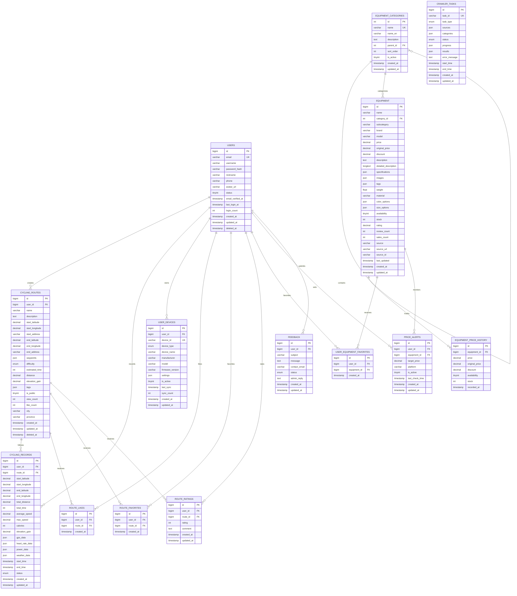

# 灵境行者 - 数据库设计文档

> **更新时间**: 2025年6月  
> **版本**: v2.1.0  
> **数据库版本**: MySQL 8.0+  

## 📋 目录

- [数据库概览](#数据库概览)
- [设计原则](#设计原则)
- [数据库架构](#数据库架构)
- [表结构设计](#表结构设计)
- [索引设计](#索引设计)
- [数据字典](#数据字典)
- [存储过程](#存储过程)
- [触发器](#触发器)
- [视图设计](#视图设计)
- [数据迁移](#数据迁移)
- [性能优化](#性能优化)
- [备份策略](#备份策略)
- [相关文档](#相关文档)

## 🗄️ 数据库概览

### 基本信息

| 项目 | 值 |
|------|----|
| 数据库名称 | `ljxz` (灵境行者) |
| 数据库引擎 | MySQL 8.0+ |
| 字符集 | `utf8mb4` |
| 排序规则 | `utf8mb4_unicode_ci` |
| 时区 | `Asia/Shanghai` |
| 存储引擎 | InnoDB |

### 连接信息

```yaml
# 开发环境
host: localhost
port: 3306
database: ljxz
username: root
password: 123456

# 生产环境
host: your-production-host
port: 3306
database: ljxz_prod
username: ljxz_user
password: your-secure-password
```

## 🎯 设计原则

### 1. 命名规范

- **表名**：使用复数形式，小写字母，下划线分隔（如：`users`, `cycling_routes`）
- **字段名**：小写字母，下划线分隔（如：`user_id`, `created_at`）
- **索引名**：`idx_表名_字段名`（如：`idx_users_email`）
- **外键名**：`fk_表名_引用表名`（如：`fk_routes_users`）

### 2. 数据类型选择

- **主键**：使用 `BIGINT UNSIGNED AUTO_INCREMENT`
- **时间戳**：使用 `TIMESTAMP` 或 `DATETIME`
- **布尔值**：使用 `TINYINT(1)`
- **文本**：根据长度选择 `VARCHAR`, `TEXT`, `LONGTEXT`
- **金额**：使用 `DECIMAL(10,2)`
- **坐标**：使用 `DECIMAL(10,7)` 保证精度

### 3. 设计模式

- **软删除**：使用 `deleted_at` 字段
- **审计字段**：每个表包含 `created_at`, `updated_at`
- **版本控制**：重要表添加 `version` 字段
- **分区策略**：大表按时间或地区分区

## 🏗️ 数据库架构

### ER 图概览



## 📊 表结构设计

### 1. 用户表 (users)

```sql
CREATE TABLE `users` (
  `id` BIGINT UNSIGNED NOT NULL AUTO_INCREMENT COMMENT '用户ID',
  `email` VARCHAR(255) NOT NULL COMMENT '邮箱地址',
  `username` VARCHAR(50) NOT NULL COMMENT '用户名',
  `password_hash` VARCHAR(255) NOT NULL COMMENT '密码哈希',
  `nickname` VARCHAR(50) DEFAULT NULL COMMENT '昵称',
  `phone` VARCHAR(20) DEFAULT NULL COMMENT '手机号',
  `avatar_url` VARCHAR(500) DEFAULT NULL COMMENT '头像URL',
  `status` TINYINT(1) NOT NULL DEFAULT 1 COMMENT '状态：1-正常，0-禁用',
  `email_verified_at` TIMESTAMP NULL DEFAULT NULL COMMENT '邮箱验证时间',
  `last_login_at` TIMESTAMP NULL DEFAULT NULL COMMENT '最后登录时间',
  `login_count` INT UNSIGNED NOT NULL DEFAULT 0 COMMENT '登录次数',
  `created_at` TIMESTAMP NOT NULL DEFAULT CURRENT_TIMESTAMP COMMENT '创建时间',
  `updated_at` TIMESTAMP NOT NULL DEFAULT CURRENT_TIMESTAMP ON UPDATE CURRENT_TIMESTAMP COMMENT '更新时间',
  `deleted_at` TIMESTAMP NULL DEFAULT NULL COMMENT '删除时间',
  PRIMARY KEY (`id`),
  UNIQUE KEY `uk_users_email` (`email`),
  UNIQUE KEY `uk_users_username` (`username`),
  KEY `idx_users_phone` (`phone`),
  KEY `idx_users_status` (`status`),
  KEY `idx_users_created_at` (`created_at`),
  KEY `idx_users_deleted_at` (`deleted_at`)
) ENGINE=InnoDB DEFAULT CHARSET=utf8mb4 COLLATE=utf8mb4_unicode_ci COMMENT='用户表';
```

### 2. 骑行路线表 (cycling_routes)

```sql
CREATE TABLE `cycling_routes` (
  `id` BIGINT UNSIGNED NOT NULL AUTO_INCREMENT COMMENT '路线ID',
  `user_id` BIGINT UNSIGNED NOT NULL COMMENT '创建用户ID',
  `name` VARCHAR(100) NOT NULL COMMENT '路线名称',
  `description` TEXT DEFAULT NULL COMMENT '路线描述',
  `start_latitude` DECIMAL(10,7) NOT NULL COMMENT '起点纬度',
  `start_longitude` DECIMAL(10,7) NOT NULL COMMENT '起点经度',
  `start_address` VARCHAR(255) DEFAULT NULL COMMENT '起点地址',
  `end_latitude` DECIMAL(10,7) NOT NULL COMMENT '终点纬度',
  `end_longitude` DECIMAL(10,7) NOT NULL COMMENT '终点经度',
  `end_address` VARCHAR(255) DEFAULT NULL COMMENT '终点地址',
  `waypoints` JSON DEFAULT NULL COMMENT '途经点坐标',
  `difficulty` ENUM('EASY','MEDIUM','HARD') NOT NULL DEFAULT 'MEDIUM' COMMENT '难度等级',
  `estimated_time` INT UNSIGNED DEFAULT NULL COMMENT '预计用时（分钟）',
  `distance` DECIMAL(8,2) DEFAULT NULL COMMENT '距离（公里）',
  `elevation_gain` DECIMAL(8,2) DEFAULT NULL COMMENT '爬升高度（米）',
  `tags` JSON DEFAULT NULL COMMENT '标签',
  `is_public` TINYINT(1) NOT NULL DEFAULT 1 COMMENT '是否公开：1-公开，0-私有',
  `view_count` INT UNSIGNED NOT NULL DEFAULT 0 COMMENT '浏览次数',
  `like_count` INT UNSIGNED NOT NULL DEFAULT 0 COMMENT '点赞次数',
  `city` VARCHAR(50) DEFAULT NULL COMMENT '所在城市',
  `province` VARCHAR(50) DEFAULT NULL COMMENT '所在省份',
  `created_at` TIMESTAMP NOT NULL DEFAULT CURRENT_TIMESTAMP COMMENT '创建时间',
  `updated_at` TIMESTAMP NOT NULL DEFAULT CURRENT_TIMESTAMP ON UPDATE CURRENT_TIMESTAMP COMMENT '更新时间',
  `deleted_at` TIMESTAMP NULL DEFAULT NULL COMMENT '删除时间',
  PRIMARY KEY (`id`),
  KEY `fk_routes_users` (`user_id`),
  KEY `idx_routes_difficulty` (`difficulty`),
  KEY `idx_routes_distance` (`distance`),
  KEY `idx_routes_city` (`city`),
  KEY `idx_routes_is_public` (`is_public`),
  KEY `idx_routes_created_at` (`created_at`),
  KEY `idx_routes_deleted_at` (`deleted_at`),
  SPATIAL KEY `idx_routes_start_location` (`start_latitude`, `start_longitude`),
  SPATIAL KEY `idx_routes_end_location` (`end_latitude`, `end_longitude`),
  CONSTRAINT `fk_routes_users` FOREIGN KEY (`user_id`) REFERENCES `users` (`id`) ON DELETE CASCADE
) ENGINE=InnoDB DEFAULT CHARSET=utf8mb4 COLLATE=utf8mb4_unicode_ci COMMENT='骑行路线表';
```

### 3. 骑行记录表 (cycling_records)

```sql
CREATE TABLE `cycling_records` (
  `id` BIGINT UNSIGNED NOT NULL AUTO_INCREMENT COMMENT '记录ID',
  `user_id` BIGINT UNSIGNED NOT NULL COMMENT '用户ID',
  `route_id` BIGINT UNSIGNED DEFAULT NULL COMMENT '路线ID',
  `start_latitude` DECIMAL(10,7) NOT NULL COMMENT '起点纬度',
  `start_longitude` DECIMAL(10,7) NOT NULL COMMENT '起点经度',
  `end_latitude` DECIMAL(10,7) DEFAULT NULL COMMENT '终点纬度',
  `end_longitude` DECIMAL(10,7) DEFAULT NULL COMMENT '终点经度',
  `total_distance` DECIMAL(8,2) DEFAULT NULL COMMENT '总距离（公里）',
  `total_time` INT UNSIGNED DEFAULT NULL COMMENT '总用时（秒）',
  `average_speed` DECIMAL(5,2) DEFAULT NULL COMMENT '平均速度（km/h）',
  `max_speed` DECIMAL(5,2) DEFAULT NULL COMMENT '最高速度（km/h）',
  `calories` INT UNSIGNED DEFAULT NULL COMMENT '消耗卡路里',
  `elevation_gain` DECIMAL(8,2) DEFAULT NULL COMMENT '爬升高度（米）',
  `gps_data` JSON DEFAULT NULL COMMENT 'GPS轨迹数据',
  `heart_rate_data` JSON DEFAULT NULL COMMENT '心率数据',
  `power_data` JSON DEFAULT NULL COMMENT '功率数据',
  `weather_data` JSON DEFAULT NULL COMMENT '天气数据',
  `start_time` TIMESTAMP NOT NULL COMMENT '开始时间',
  `end_time` TIMESTAMP DEFAULT NULL COMMENT '结束时间',
  `status` ENUM('STARTED','PAUSED','COMPLETED','CANCELLED') NOT NULL DEFAULT 'STARTED' COMMENT '状态',
  `created_at` TIMESTAMP NOT NULL DEFAULT CURRENT_TIMESTAMP COMMENT '创建时间',
  `updated_at` TIMESTAMP NOT NULL DEFAULT CURRENT_TIMESTAMP ON UPDATE CURRENT_TIMESTAMP COMMENT '更新时间',
  PRIMARY KEY (`id`),
  KEY `fk_records_users` (`user_id`),
  KEY `fk_records_routes` (`route_id`),
  KEY `idx_records_start_time` (`start_time`),
  KEY `idx_records_status` (`status`),
  KEY `idx_records_distance` (`total_distance`),
  KEY `idx_records_created_at` (`created_at`),
  CONSTRAINT `fk_records_users` FOREIGN KEY (`user_id`) REFERENCES `users` (`id`) ON DELETE CASCADE,
  CONSTRAINT `fk_records_routes` FOREIGN KEY (`route_id`) REFERENCES `cycling_routes` (`id`) ON DELETE SET NULL
) ENGINE=InnoDB DEFAULT CHARSET=utf8mb4 COLLATE=utf8mb4_unicode_ci COMMENT='骑行记录表'
PARTITION BY RANGE (YEAR(start_time)) (
  PARTITION p2024 VALUES LESS THAN (2025),
  PARTITION p2025 VALUES LESS THAN (2026),
  PARTITION p2026 VALUES LESS THAN (2027),
  PARTITION p_future VALUES LESS THAN MAXVALUE
);
```

### 4. 装备分类表 (equipment_categories)

```sql
CREATE TABLE `equipment_categories` (
  `id` INT UNSIGNED NOT NULL AUTO_INCREMENT COMMENT '分类ID',
  `name` VARCHAR(50) NOT NULL COMMENT '分类名称',
  `name_en` VARCHAR(50) NOT NULL COMMENT '英文名称',
  `description` TEXT DEFAULT NULL COMMENT '分类描述',
  `parent_id` INT UNSIGNED DEFAULT NULL COMMENT '父分类ID',
  `sort_order` INT NOT NULL DEFAULT 0 COMMENT '排序',
  `is_active` TINYINT(1) NOT NULL DEFAULT 1 COMMENT '是否启用',
  `created_at` TIMESTAMP NOT NULL DEFAULT CURRENT_TIMESTAMP COMMENT '创建时间',
  `updated_at` TIMESTAMP NOT NULL DEFAULT CURRENT_TIMESTAMP ON UPDATE CURRENT_TIMESTAMP COMMENT '更新时间',
  PRIMARY KEY (`id`),
  UNIQUE KEY `uk_categories_name` (`name`),
  KEY `fk_categories_parent` (`parent_id`),
  KEY `idx_categories_sort` (`sort_order`),
  KEY `idx_categories_active` (`is_active`),
  CONSTRAINT `fk_categories_parent` FOREIGN KEY (`parent_id`) REFERENCES `equipment_categories` (`id`) ON DELETE SET NULL
) ENGINE=InnoDB DEFAULT CHARSET=utf8mb4 COLLATE=utf8mb4_unicode_ci COMMENT='装备分类表';
```

### 5. 设备信息表 (equipment)

```sql
CREATE TABLE `equipment` (
  `id` BIGINT UNSIGNED NOT NULL AUTO_INCREMENT COMMENT '设备ID',
  `name` VARCHAR(255) NOT NULL COMMENT '设备名称',
  `category_id` INT UNSIGNED NOT NULL COMMENT '分类ID',
  `subcategory` VARCHAR(50) DEFAULT NULL COMMENT '子类别',
  `brand` VARCHAR(100) NOT NULL COMMENT '品牌',
  `model` VARCHAR(100) DEFAULT NULL COMMENT '型号',
  `price` DECIMAL(10,2) DEFAULT NULL COMMENT '当前价格',
  `original_price` DECIMAL(10,2) DEFAULT NULL COMMENT '原价',
  `discount` DECIMAL(3,2) DEFAULT NULL COMMENT '折扣率',
  `description` TEXT DEFAULT NULL COMMENT '描述',
  `detailed_description` LONGTEXT DEFAULT NULL COMMENT '详细描述',
  `specifications` JSON DEFAULT NULL COMMENT '规格参数',
  `images` JSON DEFAULT NULL COMMENT '图片URLs',
  `tags` JSON DEFAULT NULL COMMENT '标签',
  `weight` FLOAT DEFAULT NULL COMMENT '重量(克)',
  `material` VARCHAR(200) DEFAULT NULL COMMENT '材质',
  `color_options` JSON DEFAULT NULL COMMENT '颜色选项',
  `size_options` JSON DEFAULT NULL COMMENT '尺寸选项',
  `availability` TINYINT(1) NOT NULL DEFAULT 1 COMMENT '是否有货',
  `stock` INT UNSIGNED DEFAULT NULL COMMENT '库存数量',
  `rating` DECIMAL(3,2) DEFAULT NULL COMMENT '评分',
  `review_count` INT UNSIGNED NOT NULL DEFAULT 0 COMMENT '评价数量',
  `sales_count` INT UNSIGNED NOT NULL DEFAULT 0 COMMENT '销量',
  `source` VARCHAR(50) NOT NULL COMMENT '数据来源',
  `source_url` VARCHAR(500) DEFAULT NULL COMMENT '来源URL',
  `source_id` VARCHAR(100) DEFAULT NULL COMMENT '来源商品ID',
  `last_updated` TIMESTAMP NOT NULL DEFAULT CURRENT_TIMESTAMP ON UPDATE CURRENT_TIMESTAMP COMMENT '最后更新时间',
  `created_at` TIMESTAMP NOT NULL DEFAULT CURRENT_TIMESTAMP COMMENT '创建时间',
  `updated_at` TIMESTAMP NOT NULL DEFAULT CURRENT_TIMESTAMP ON UPDATE CURRENT_TIMESTAMP COMMENT '更新时间',
  PRIMARY KEY (`id`),
  UNIQUE KEY `uk_equipment_source` (`source`, `source_id`),
  KEY `fk_equipment_category` (`category_id`),
  KEY `idx_equipment_brand` (`brand`),
  KEY `idx_equipment_price` (`price`),
  KEY `idx_equipment_rating` (`rating`),
  KEY `idx_equipment_availability` (`availability`),
  KEY `idx_equipment_last_updated` (`last_updated`),
  FULLTEXT KEY `ft_equipment_search` (`name`, `description`, `brand`),
  CONSTRAINT `fk_equipment_category` FOREIGN KEY (`category_id`) REFERENCES `equipment_categories` (`id`) ON DELETE RESTRICT
) ENGINE=InnoDB DEFAULT CHARSET=utf8mb4 COLLATE=utf8mb4_unicode_ci COMMENT='设备信息表';
```

### 6. 路线收藏表 (route_favorites)

```sql
CREATE TABLE `route_favorites` (
  `id` BIGINT UNSIGNED NOT NULL AUTO_INCREMENT COMMENT '记录ID',
  `user_id` BIGINT UNSIGNED NOT NULL COMMENT '用户ID',
  `route_id` BIGINT UNSIGNED NOT NULL COMMENT '路线ID',
  `created_at` TIMESTAMP NOT NULL DEFAULT CURRENT_TIMESTAMP COMMENT '创建时间',
  PRIMARY KEY (`id`),
  UNIQUE KEY `uk_route_favorites` (`user_id`, `route_id`),
  KEY `fk_route_favorites_users` (`user_id`),
  KEY `fk_route_favorites_routes` (`route_id`),
  CONSTRAINT `fk_route_favorites_users` FOREIGN KEY (`user_id`) REFERENCES `users` (`id`) ON DELETE CASCADE,
  CONSTRAINT `fk_route_favorites_routes` FOREIGN KEY (`route_id`) REFERENCES `cycling_routes` (`id`) ON DELETE CASCADE
) ENGINE=InnoDB DEFAULT CHARSET=utf8mb4 COLLATE=utf8mb4_unicode_ci COMMENT='路线收藏表';
```

### 7. 路线评分表 (route_ratings)

```sql
CREATE TABLE `route_ratings` (
  `id` BIGINT UNSIGNED NOT NULL AUTO_INCREMENT COMMENT '记录ID',
  `user_id` BIGINT UNSIGNED NOT NULL COMMENT '用户ID',
  `route_id` BIGINT UNSIGNED NOT NULL COMMENT '路线ID',
  `rating` INT NOT NULL COMMENT '评分（1-5）',
  `comment` TEXT DEFAULT NULL COMMENT '评价内容',
  `created_at` TIMESTAMP NOT NULL DEFAULT CURRENT_TIMESTAMP COMMENT '创建时间',
  `updated_at` TIMESTAMP NOT NULL DEFAULT CURRENT_TIMESTAMP ON UPDATE CURRENT_TIMESTAMP COMMENT '更新时间',
  PRIMARY KEY (`id`),
  UNIQUE KEY `uk_route_ratings` (`user_id`, `route_id`),
  KEY `fk_route_ratings_users` (`user_id`),
  KEY `fk_route_ratings_routes` (`route_id`),
  KEY `idx_route_ratings_rating` (`rating`),
  CONSTRAINT `fk_route_ratings_users` FOREIGN KEY (`user_id`) REFERENCES `users` (`id`) ON DELETE CASCADE,
  CONSTRAINT `fk_route_ratings_routes` FOREIGN KEY (`route_id`) REFERENCES `cycling_routes` (`id`) ON DELETE CASCADE,
  CONSTRAINT `chk_rating_range` CHECK (`rating` >= 1 AND `rating` <= 5)
) ENGINE=InnoDB DEFAULT CHARSET=utf8mb4 COLLATE=utf8mb4_unicode_ci COMMENT='路线评分表';
```

### 8. 用户装备收藏表 (user_equipment_favorites)

```sql
CREATE TABLE `user_equipment_favorites` (
  `id` BIGINT UNSIGNED NOT NULL AUTO_INCREMENT COMMENT '记录ID',
  `user_id` BIGINT UNSIGNED NOT NULL COMMENT '用户ID',
  `equipment_id` BIGINT UNSIGNED NOT NULL COMMENT '设备ID',
  `created_at` TIMESTAMP NOT NULL DEFAULT CURRENT_TIMESTAMP COMMENT '创建时间',
  PRIMARY KEY (`id`),
  UNIQUE KEY `uk_user_equipment_favorites` (`user_id`, `equipment_id`),
  KEY `fk_user_equipment_favorites_users` (`user_id`),
  KEY `fk_user_equipment_favorites_equipment` (`equipment_id`),
  CONSTRAINT `fk_user_equipment_favorites_users` FOREIGN KEY (`user_id`) REFERENCES `users` (`id`) ON DELETE CASCADE,
  CONSTRAINT `fk_user_equipment_favorites_equipment` FOREIGN KEY (`equipment_id`) REFERENCES `equipment` (`id`) ON DELETE CASCADE
) ENGINE=InnoDB DEFAULT CHARSET=utf8mb4 COLLATE=utf8mb4_unicode_ci COMMENT='用户设备收藏表';
```

### 9. 价格提醒表 (price_alerts)

```sql
CREATE TABLE `price_alerts` (
  `id` BIGINT UNSIGNED NOT NULL AUTO_INCREMENT COMMENT '记录ID',
  `user_id` BIGINT UNSIGNED NOT NULL COMMENT '用户ID',
  `equipment_id` BIGINT UNSIGNED NOT NULL COMMENT '设备ID',
  `target_price` DECIMAL(10,2) NOT NULL COMMENT '目标价格',
  `platform` VARCHAR(50) DEFAULT NULL COMMENT '指定平台',
  `is_active` TINYINT(1) NOT NULL DEFAULT 1 COMMENT '是否启用',
  `last_check_time` TIMESTAMP NULL DEFAULT NULL COMMENT '最后检查时间',
  `created_at` TIMESTAMP NOT NULL DEFAULT CURRENT_TIMESTAMP COMMENT '创建时间',
  `updated_at` TIMESTAMP NOT NULL DEFAULT CURRENT_TIMESTAMP ON UPDATE CURRENT_TIMESTAMP COMMENT '更新时间',
  PRIMARY KEY (`id`),
  KEY `fk_price_alerts_users` (`user_id`),
  KEY `fk_price_alerts_equipment` (`equipment_id`),
  KEY `idx_price_alerts_active` (`is_active`),
  CONSTRAINT `fk_price_alerts_users` FOREIGN KEY (`user_id`) REFERENCES `users` (`id`) ON DELETE CASCADE,
  CONSTRAINT `fk_price_alerts_equipment` FOREIGN KEY (`equipment_id`) REFERENCES `equipment` (`id`) ON DELETE CASCADE
) ENGINE=InnoDB DEFAULT CHARSET=utf8mb4 COLLATE=utf8mb4_unicode_ci COMMENT='价格提醒表';
```

### 10. 用户设备表 (user_devices)

```sql
CREATE TABLE `user_devices` (
  `id` BIGINT UNSIGNED NOT NULL AUTO_INCREMENT COMMENT '记录ID',
  `user_id` BIGINT UNSIGNED NOT NULL COMMENT '用户ID',
  `device_id` VARCHAR(100) NOT NULL COMMENT '设备唯一标识',
  `device_type` ENUM('BIKE_COMPUTER','HEART_RATE_MONITOR','POWER_METER','SMART_TRAINER','MOBILE_APP') NOT NULL COMMENT '设备类型',
  `device_name` VARCHAR(100) NOT NULL COMMENT '设备名称',
  `manufacturer` VARCHAR(50) DEFAULT NULL COMMENT '制造商',
  `model` VARCHAR(50) DEFAULT NULL COMMENT '型号',
  `firmware_version` VARCHAR(20) DEFAULT NULL COMMENT '固件版本',
  `settings` JSON DEFAULT NULL COMMENT '设备设置',
  `is_active` TINYINT(1) NOT NULL DEFAULT 1 COMMENT '是否激活',
  `last_sync` TIMESTAMP NULL DEFAULT NULL COMMENT '最后同步时间',
  `sync_count` INT UNSIGNED NOT NULL DEFAULT 0 COMMENT '同步次数',
  `created_at` TIMESTAMP NOT NULL DEFAULT CURRENT_TIMESTAMP COMMENT '创建时间',
  `updated_at` TIMESTAMP NOT NULL DEFAULT CURRENT_TIMESTAMP ON UPDATE CURRENT_TIMESTAMP COMMENT '更新时间',
  PRIMARY KEY (`id`),
  UNIQUE KEY `uk_user_devices` (`user_id`, `device_id`),
  KEY `fk_user_devices_users` (`user_id`),
  KEY `idx_user_devices_type` (`device_type`),
  KEY `idx_user_devices_active` (`is_active`),
  CONSTRAINT `fk_user_devices_users` FOREIGN KEY (`user_id`) REFERENCES `users` (`id`) ON DELETE CASCADE
) ENGINE=InnoDB DEFAULT CHARSET=utf8mb4 COLLATE=utf8mb4_unicode_ci COMMENT='用户设备表';
```

### 6. 路线点赞表 (route_likes)

```sql
CREATE TABLE `route_likes` (
  `id` BIGINT UNSIGNED NOT NULL AUTO_INCREMENT COMMENT '记录ID',
  `user_id` BIGINT UNSIGNED NOT NULL COMMENT '用户ID',
  `route_id` BIGINT UNSIGNED NOT NULL COMMENT '路线ID',
  `created_at` TIMESTAMP NOT NULL DEFAULT CURRENT_TIMESTAMP COMMENT '创建时间',
  PRIMARY KEY (`id`),
  UNIQUE KEY `uk_route_likes` (`user_id`, `route_id`),
  KEY `fk_route_likes_users` (`user_id`),
  KEY `fk_route_likes_routes` (`route_id`),
  CONSTRAINT `fk_route_likes_users` FOREIGN KEY (`user_id`) REFERENCES `users` (`id`) ON DELETE CASCADE,
  CONSTRAINT `fk_route_likes_routes` FOREIGN KEY (`route_id`) REFERENCES `cycling_routes` (`id`) ON DELETE CASCADE
) ENGINE=InnoDB DEFAULT CHARSET=utf8mb4 COLLATE=utf8mb4_unicode_ci COMMENT='路线点赞表';
```

### 7. 设备价格历史表 (equipment_price_history)

```sql
CREATE TABLE `equipment_price_history` (
  `id` BIGINT UNSIGNED NOT NULL AUTO_INCREMENT COMMENT '记录ID',
  `equipment_id` BIGINT UNSIGNED NOT NULL COMMENT '设备ID',
  `price` DECIMAL(10,2) NOT NULL COMMENT '价格',
  `original_price` DECIMAL(10,2) DEFAULT NULL COMMENT '原价',
  `discount` DECIMAL(3,2) DEFAULT NULL COMMENT '折扣率',
  `availability` TINYINT(1) NOT NULL COMMENT '是否有货',
  `stock` INT UNSIGNED DEFAULT NULL COMMENT '库存数量',
  `recorded_at` TIMESTAMP NOT NULL DEFAULT CURRENT_TIMESTAMP COMMENT '记录时间',
  PRIMARY KEY (`id`),
  KEY `fk_price_history_equipment` (`equipment_id`),
  KEY `idx_price_history_recorded_at` (`recorded_at`),
  KEY `idx_price_history_price` (`price`),
  CONSTRAINT `fk_price_history_equipment` FOREIGN KEY (`equipment_id`) REFERENCES `equipment` (`id`) ON DELETE CASCADE
) ENGINE=InnoDB DEFAULT CHARSET=utf8mb4 COLLATE=utf8mb4_unicode_ci COMMENT='设备价格历史表'
PARTITION BY RANGE (YEAR(recorded_at)) (
  PARTITION p2024 VALUES LESS THAN (2025),
  PARTITION p2025 VALUES LESS THAN (2026),
  PARTITION p2026 VALUES LESS THAN (2027),
  PARTITION p_future VALUES LESS THAN MAXVALUE
);
```

### 8. 爬虫任务表 (crawler_tasks)

```sql
CREATE TABLE `crawler_tasks` (
  `id` BIGINT UNSIGNED NOT NULL AUTO_INCREMENT COMMENT '任务ID',
  `task_id` VARCHAR(50) NOT NULL COMMENT '任务唯一标识',
  `task_type` ENUM('FULL_CRAWL','INCREMENTAL_CRAWL','PRICE_UPDATE') NOT NULL COMMENT '任务类型',
  `sources` JSON NOT NULL COMMENT '爬取来源',
  `categories` JSON DEFAULT NULL COMMENT '爬取类别',
  `status` ENUM('PENDING','RUNNING','COMPLETED','FAILED','CANCELLED') NOT NULL DEFAULT 'PENDING' COMMENT '任务状态',
  `progress` JSON DEFAULT NULL COMMENT '进度信息',
  `results` JSON DEFAULT NULL COMMENT '结果统计',
  `error_message` TEXT DEFAULT NULL COMMENT '错误信息',
  `start_time` TIMESTAMP NULL DEFAULT NULL COMMENT '开始时间',
  `end_time` TIMESTAMP NULL DEFAULT NULL COMMENT '结束时间',
  `created_at` TIMESTAMP NOT NULL DEFAULT CURRENT_TIMESTAMP COMMENT '创建时间',
  `updated_at` TIMESTAMP NOT NULL DEFAULT CURRENT_TIMESTAMP ON UPDATE CURRENT_TIMESTAMP COMMENT '更新时间',
  PRIMARY KEY (`id`),
  UNIQUE KEY `uk_crawler_tasks_task_id` (`task_id`),
  KEY `idx_crawler_tasks_status` (`status`),
  KEY `idx_crawler_tasks_type` (`task_type`),
  KEY `idx_crawler_tasks_start_time` (`start_time`)
) ENGINE=InnoDB DEFAULT CHARSET=utf8mb4 COLLATE=utf8mb4_unicode_ci COMMENT='爬虫任务表';
```

## 🔍 索引设计

### 主要索引策略

#### 1. 主键索引
- 所有表使用 `BIGINT UNSIGNED AUTO_INCREMENT` 主键
- 保证全局唯一性和高性能

#### 2. 唯一索引
```sql
-- 用户邮箱唯一索引
CREATE UNIQUE INDEX uk_users_email ON users(email);

-- 设备来源唯一索引
CREATE UNIQUE INDEX uk_equipment_source ON equipment(source, source_id);

-- 用户设备唯一索引
CREATE UNIQUE INDEX uk_user_devices ON user_devices(user_id, device_id);
```

#### 3. 复合索引
```sql
-- 路线查询复合索引
CREATE INDEX idx_routes_query ON cycling_routes(is_public, difficulty, city, created_at);

-- 设备搜索复合索引
CREATE INDEX idx_equipment_search ON equipment(category, brand, availability, price);

-- 骑行记录查询索引
CREATE INDEX idx_records_user_time ON cycling_records(user_id, start_time, status);
```

#### 4. 全文索引
```sql
-- 设备搜索全文索引
CREATE FULLTEXT INDEX ft_equipment_search ON equipment(name, description, brand);
```

#### 5. 空间索引
```sql
-- 地理位置空间索引
CREATE SPATIAL INDEX idx_routes_start_location ON cycling_routes(start_latitude, start_longitude);
CREATE SPATIAL INDEX idx_routes_end_location ON cycling_routes(end_latitude, end_longitude);
```

## 📚 数据字典

### 枚举值定义

#### 路线难度 (difficulty)
| 值 | 说明 | 描述 |
|----|------|------|
| EASY | 简单 | 平坦路线，适合初学者 |
| MEDIUM | 中等 | 有一定起伏，适合有经验的骑行者 |
| HARD | 困难 | 山地路线，需要较强体力 |

#### 设备类型 (device_type)
| 值 | 说明 | 描述 |
|----|------|------|
| BIKE_COMPUTER | 码表 | 自行车码表设备 |
| HEART_RATE_MONITOR | 心率监测器 | 心率带或手表 |
| POWER_METER | 功率计 | 功率测量设备 |
| SMART_TRAINER | 智能训练台 | 室内训练设备 |
| MOBILE_APP | 手机应用 | 移动端应用 |

#### 骑行状态 (status)
| 值 | 说明 | 描述 |
|----|------|------|
| STARTED | 已开始 | 骑行进行中 |
| PAUSED | 已暂停 | 临时暂停 |
| COMPLETED | 已完成 | 正常结束 |
| CANCELLED | 已取消 | 中途取消 |

### JSON 字段结构

#### waypoints (路线途经点)
```json
[
  {
    "latitude": 30.2641,
    "longitude": 120.1451,
    "address": "途经点地址",
    "name": "途经点名称",
    "order": 1
  }
]
```

#### gps_data (GPS轨迹数据)
```json
{
  "points": [
    {
      "timestamp": "2025-01-01T12:00:00Z",
      "latitude": 30.2741,
      "longitude": 120.1551,
      "altitude": 25.5,
      "speed": 15.2,
      "accuracy": 3.0
    }
  ],
  "summary": {
    "totalPoints": 1200,
    "avgAccuracy": 3.5,
    "trackingDuration": 3600
  }
}
```

#### specifications (设备规格)
```json
{
  "frame": "铝合金车架",
  "wheelSize": "26寸",
  "gears": "21速",
  "weight": "13.5kg",
  "maxLoad": "120kg",
  "brakes": "V刹",
  "suspension": "前叉避震"
}
```

## 🔧 存储过程

### 1. 更新路线统计信息

```sql
DELIMITER //

CREATE PROCEDURE UpdateRouteStats(IN route_id BIGINT)
BEGIN
    DECLARE like_count INT DEFAULT 0;
    DECLARE record_count INT DEFAULT 0;
    
    -- 计算点赞数
    SELECT COUNT(*) INTO like_count 
    FROM route_likes 
    WHERE route_id = route_id;
    
    -- 计算骑行记录数
    SELECT COUNT(*) INTO record_count 
    FROM cycling_records 
    WHERE route_id = route_id AND status = 'COMPLETED';
    
    -- 更新路线统计
    UPDATE cycling_routes 
    SET 
        like_count = like_count,
        view_count = view_count + 1
    WHERE id = route_id;
    
END //

DELIMITER ;
```

### 2. 用户统计信息

```sql
DELIMITER //

CREATE PROCEDURE GetUserStats(IN user_id BIGINT)
BEGIN
    SELECT 
        u.id,
        u.nickname,
        COUNT(DISTINCT cr.id) as total_routes,
        COUNT(DISTINCT rec.id) as total_records,
        COALESCE(SUM(rec.total_distance), 0) as total_distance,
        COALESCE(SUM(rec.total_time), 0) as total_time,
        COALESCE(AVG(rec.average_speed), 0) as avg_speed,
        COALESCE(SUM(rec.calories), 0) as total_calories
    FROM users u
    LEFT JOIN cycling_routes cr ON u.id = cr.user_id AND cr.deleted_at IS NULL
    LEFT JOIN cycling_records rec ON u.id = rec.user_id AND rec.status = 'COMPLETED'
    WHERE u.id = user_id
    GROUP BY u.id, u.nickname;
END //

DELIMITER ;
```

## ⚡ 触发器

### 1. 路线点赞触发器

```sql
DELIMITER //

CREATE TRIGGER tr_route_like_insert
AFTER INSERT ON route_likes
FOR EACH ROW
BEGIN
    UPDATE cycling_routes 
    SET like_count = like_count + 1 
    WHERE id = NEW.route_id;
END //

CREATE TRIGGER tr_route_like_delete
AFTER DELETE ON route_likes
FOR EACH ROW
BEGIN
    UPDATE cycling_routes 
    SET like_count = like_count - 1 
    WHERE id = OLD.route_id;
END //

DELIMITER ;
```

### 2. 设备价格历史触发器

```sql
DELIMITER //

CREATE TRIGGER tr_equipment_price_update
AFTER UPDATE ON equipment
FOR EACH ROW
BEGIN
    IF OLD.price != NEW.price OR OLD.availability != NEW.availability THEN
        INSERT INTO equipment_price_history (
            equipment_id, price, original_price, discount, 
            availability, stock, recorded_at
        ) VALUES (
            NEW.id, NEW.price, NEW.original_price, NEW.discount,
            NEW.availability, NEW.stock, NOW()
        );
    END IF;
END //

DELIMITER ;
```

## 👁️ 视图设计

### 1. 热门路线视图

```sql
CREATE VIEW v_popular_routes AS
SELECT 
    cr.id,
    cr.name,
    cr.description,
    cr.difficulty,
    cr.distance,
    cr.estimated_time,
    cr.city,
    cr.like_count,
    cr.view_count,
    u.nickname as creator_name,
    COUNT(rec.id) as completion_count,
    AVG(rec.total_time) as avg_completion_time,
    cr.created_at
FROM cycling_routes cr
JOIN users u ON cr.user_id = u.id
LEFT JOIN cycling_records rec ON cr.id = rec.route_id AND rec.status = 'COMPLETED'
WHERE cr.is_public = 1 AND cr.deleted_at IS NULL
GROUP BY cr.id, cr.name, cr.description, cr.difficulty, cr.distance, 
         cr.estimated_time, cr.city, cr.like_count, cr.view_count, 
         u.nickname, cr.created_at
ORDER BY (cr.like_count * 0.4 + cr.view_count * 0.3 + COUNT(rec.id) * 0.3) DESC;
```

### 2. 设备价格趋势视图

```sql
CREATE VIEW v_equipment_price_trends AS
SELECT 
    e.id,
    e.name,
    e.brand,
    e.category,
    e.price as current_price,
    ph_week.avg_price as week_avg_price,
    ph_month.avg_price as month_avg_price,
    (e.price - ph_week.avg_price) / ph_week.avg_price * 100 as week_change_percent,
    (e.price - ph_month.avg_price) / ph_month.avg_price * 100 as month_change_percent
FROM equipment e
LEFT JOIN (
    SELECT 
        equipment_id,
        AVG(price) as avg_price
    FROM equipment_price_history 
    WHERE recorded_at >= DATE_SUB(NOW(), INTERVAL 7 DAY)
    GROUP BY equipment_id
) ph_week ON e.id = ph_week.equipment_id
LEFT JOIN (
    SELECT 
        equipment_id,
        AVG(price) as avg_price
    FROM equipment_price_history 
    WHERE recorded_at >= DATE_SUB(NOW(), INTERVAL 30 DAY)
    GROUP BY equipment_id
) ph_month ON e.id = ph_month.equipment_id
WHERE e.availability = 1;
```

## 🔄 数据迁移

### 初始化脚本

```sql
-- 创建数据库
CREATE DATABASE IF NOT EXISTS ljxz 
CHARACTER SET utf8mb4 
COLLATE utf8mb4_unicode_ci;

USE ljxz;

-- 设置时区
SET time_zone = '+08:00';

-- 创建用户（生产环境）
CREATE USER IF NOT EXISTS 'ljxz_user'@'%' IDENTIFIED BY 'secure_password';
GRANT SELECT, INSERT, UPDATE, DELETE ON ljxz.* TO 'ljxz_user'@'%';
FLUSH PRIVILEGES;
```

### 数据迁移脚本

```sql
-- V1.0.0 初始化表结构
SOURCE database/migrations/V1_0_0__create_initial_tables.sql;

-- V1.0.1 添加索引
SOURCE database/migrations/V1_0_1__add_indexes.sql;

-- V1.0.2 添加触发器和存储过程
SOURCE database/migrations/V1_0_2__add_triggers_procedures.sql;

-- V1.0.3 添加视图
SOURCE database/migrations/V1_0_3__add_views.sql;

-- 插入初始数据
SOURCE database/seeds/initial_data.sql;
```

### 示例数据

```sql
-- 插入测试用户
INSERT INTO users (email, username, password_hash, nickname, phone) VALUES
('admin@ljxz.com', 'admin', '$2y$10$92IXUNpkjO0rOQ5byMi.Ye4oKoEa3Ro9llC/.og/at2.uheWG/igi', '管理员', '13800138000'),
('test@ljxz.com', 'testuser', '$2y$10$92IXUNpkjO0rOQ5byMi.Ye4oKoEa3Ro9llC/.og/at2.uheWG/igi', '测试用户', '13900139000');

-- 插入示例路线
INSERT INTO cycling_routes (user_id, name, description, start_latitude, start_longitude, start_address, end_latitude, end_longitude, end_address, difficulty, estimated_time, distance, city, province) VALUES
(1, '西湖环线', '杭州西湖经典骑行路线', 30.2741, 120.1551, '杭州市西湖区', 30.2441, 120.1351, '杭州市西湖区', 'EASY', 120, 15.5, '杭州', '浙江'),
(1, '千岛湖环湖', '千岛湖风景区环湖骑行', 29.6050, 119.0350, '淳安县千岛湖镇', 29.6050, 119.0350, '淳安县千岛湖镇', 'MEDIUM', 300, 45.2, '杭州', '浙江');

-- 插入设备类别
INSERT INTO equipment (name, category, brand, price, original_price, description, availability, source, source_url) VALUES
('捷安特 ATX 810', '山地车', '捷安特', 2998.00, 3298.00, '入门级山地车，适合城市骑行', 1, '京东', 'https://item.jd.com/example1.html'),
('美利达 公爵 600', '山地车', '美利达', 1998.00, 2298.00, '性价比山地车，适合新手', 1, '天猫', 'https://detail.tmall.com/example2.html');
```

## ⚡ 性能优化

### 1. 查询优化

#### 分页查询优化
```sql
-- 避免 OFFSET 大数值的性能问题
-- 使用游标分页
SELECT * FROM cycling_routes 
WHERE id > ? 
ORDER BY id 
LIMIT 20;

-- 复合索引覆盖查询
SELECT id, name, difficulty, distance 
FROM cycling_routes 
WHERE is_public = 1 AND city = '杭州' 
ORDER BY created_at DESC 
LIMIT 20;
```

#### 地理位置查询优化
```sql
-- 使用空间索引进行范围查询
SELECT id, name, distance 
FROM cycling_routes 
WHERE ST_Distance_Sphere(
    POINT(start_longitude, start_latitude),
    POINT(120.1551, 30.2741)
) <= 10000  -- 10公里范围内
ORDER BY ST_Distance_Sphere(
    POINT(start_longitude, start_latitude),
    POINT(120.1551, 30.2741)
);
```

### 2. 索引优化策略

```sql
-- 分析查询性能
EXPLAIN SELECT * FROM cycling_routes 
WHERE is_public = 1 AND difficulty = 'MEDIUM' AND city = '杭州';

-- 创建覆盖索引
CREATE INDEX idx_routes_cover ON cycling_routes(
    is_public, difficulty, city, id, name, distance, created_at
);

-- 删除重复或无用索引
DROP INDEX idx_routes_city ON cycling_routes;
```

### 3. 分区策略

```sql
-- 按年份分区骑行记录表
ALTER TABLE cycling_records 
PARTITION BY RANGE (YEAR(start_time)) (
    PARTITION p2024 VALUES LESS THAN (2025),
    PARTITION p2025 VALUES LESS THAN (2026),
    PARTITION p2026 VALUES LESS THAN (2027),
    PARTITION p_future VALUES LESS THAN MAXVALUE
);

-- 分区维护
-- 添加新分区
ALTER TABLE cycling_records 
ADD PARTITION (PARTITION p2027 VALUES LESS THAN (2028));

-- 删除旧分区
ALTER TABLE cycling_records 
DROP PARTITION p2024;
```

### 4. 缓存策略

```sql
-- 查询缓存配置
SET GLOBAL query_cache_type = ON;
SET GLOBAL query_cache_size = 268435456; -- 256MB

-- 使用 SQL_CACHE 提示
SELECT SQL_CACHE id, name, difficulty 
FROM cycling_routes 
WHERE is_public = 1 
ORDER BY like_count DESC 
LIMIT 10;
```

## 💾 备份策略

### 1. 全量备份

```bash
#!/bin/bash
# 全量备份脚本

BACKUP_DIR="/backup/mysql"
DATE=$(date +"%Y%m%d_%H%M%S")
BACKUP_FILE="ljxz_full_${DATE}.sql"

# 创建备份目录
mkdir -p $BACKUP_DIR

# 执行备份
mysqldump -u root -p123456 \
  --single-transaction \
  --routines \
  --triggers \
  --events \
  --hex-blob \
  ljxz > $BACKUP_DIR/$BACKUP_FILE

# 压缩备份文件
gzip $BACKUP_DIR/$BACKUP_FILE

# 删除7天前的备份
find $BACKUP_DIR -name "ljxz_full_*.sql.gz" -mtime +7 -delete

echo "Backup completed: $BACKUP_FILE.gz"
```

### 2. 增量备份

```bash
#!/bin/bash
# 增量备份脚本（基于 binlog）

BINLOG_DIR="/var/log/mysql"
BACKUP_DIR="/backup/mysql/incremental"
DATE=$(date +"%Y%m%d_%H%M%S")

# 刷新日志
mysql -u root -p123456 -e "FLUSH LOGS;"

# 复制 binlog 文件
cp $BINLOG_DIR/mysql-bin.* $BACKUP_DIR/

# 记录备份时间点
echo "Incremental backup at $DATE" >> $BACKUP_DIR/backup.log
```

### 3. 恢复脚本

```bash
#!/bin/bash
# 数据恢复脚本

BACKUP_FILE=$1
TARGET_DB="ljxz_restore"

if [ -z "$BACKUP_FILE" ]; then
    echo "Usage: $0 <backup_file>"
    exit 1
fi

# 创建恢复数据库
mysql -u root -p123456 -e "CREATE DATABASE IF NOT EXISTS $TARGET_DB;"

# 恢复数据
if [[ $BACKUP_FILE == *.gz ]]; then
    gunzip -c $BACKUP_FILE | mysql -u root -p123456 $TARGET_DB
else
    mysql -u root -p123456 $TARGET_DB < $BACKUP_FILE
fi

echo "Database restored to $TARGET_DB"
```

### 4. 监控脚本

```bash
#!/bin/bash
# 数据库监控脚本

# 检查数据库连接
mysql -u root -p123456 -e "SELECT 1;" > /dev/null 2>&1
if [ $? -ne 0 ]; then
    echo "ERROR: Cannot connect to MySQL" | mail -s "DB Alert" admin@ljxz.com
fi

# 检查表空间使用率
USAGE=$(mysql -u root -p123456 -e "SELECT ROUND(SUM(data_length + index_length) / 1024 / 1024, 2) AS 'DB Size in MB' FROM information_schema.tables WHERE table_schema='ljxz';" | tail -1)

if (( $(echo "$USAGE > 1000" | bc -l) )); then
    echo "WARNING: Database size is ${USAGE}MB" | mail -s "DB Size Alert" admin@ljxz.com
fi

# 检查慢查询
SLOW_QUERIES=$(mysql -u root -p123456 -e "SHOW GLOBAL STATUS LIKE 'Slow_queries';" | tail -1 | awk '{print $2}')
echo "Slow queries: $SLOW_QUERIES"
```

---

## 📚 相关文档

### 项目文档
- [项目总览](../README.md) - 项目整体介绍和架构
- [前端文档](../vue-cycling-app/README.md) - Vue3前端应用文档
- [Java后端文档](../java-backend/README.md) - Spring Boot后端服务文档
- [Python后端文档](../python-backend/README.md) - Flask爬虫服务文档

### 数据库相关
- [数据库设置指南](../vue-cycling-app/DATABASE_SETUP.md) - 数据库安装和配置指南
- [API接口文档](../vue-cycling-app/API_ENDPOINTS.md) - 数据库相关API接口
- [完整初始化脚本](../database/complete_init.sql) - 数据库完整建表脚本
- [测试数据脚本](../database/test_data.sql) - 测试数据插入脚本

### 技术文档
- [架构设计文档](./ARCHITECTURE.md) - 系统架构设计
- [开发指南](./DEVELOPMENT.md) - 开发环境搭建和规范
- [部署文档](./DEPLOYMENT.md) - 生产环境部署指南
- [安全文档](./SECURITY.md) - 安全策略和最佳实践

### 外部资源
- [MySQL官方文档](https://dev.mysql.com/doc/) - MySQL数据库官方文档
- [Spring Data JPA文档](https://spring.io/projects/spring-data-jpa) - Java后端ORM框架
- [SQLAlchemy文档](https://docs.sqlalchemy.org/) - Python后端ORM框架

---

## 📞 技术支持

如需数据库相关技术支持，请联系：

- **数据库管理员**：dba@ljxz.com
- **开发团队**：dev@ljxz.com
- **项目仓库**：[GitHub Repository](https://github.com/ljxz/cycling-app)

---

## 📝 更新日志

### v2.1.0 (2025年6月)
- 完善装备相关表结构设计
- 添加价格历史和用户收藏功能
- 优化索引设计和查询性能
- 更新文档结构和相关链接

### v2.0.0 (2025年5月)
- 重构数据库架构设计
- 添加装备管理相关表
- 完善用户系统和权限管理
- 优化表结构和字段设计

---

*本文档最后更新时间：2025年6月*